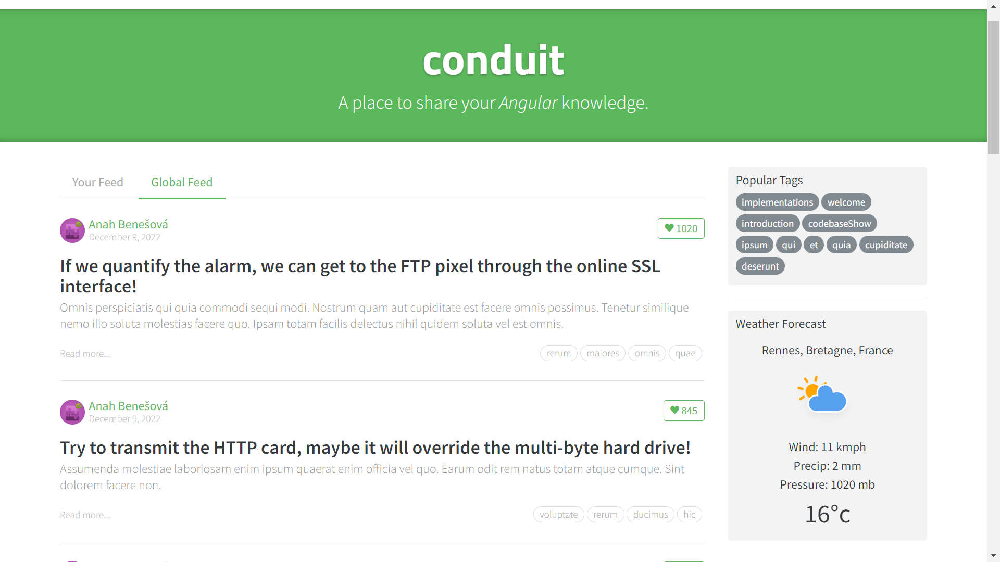

# ![PROJET WE]

Modification du projet open source Realworld (version implémentation Angular) pour le projet de WE.
Ajout d'un onglet météo en temps réel. Les données sont récupérées sur le site de [Weatherstack](https://weatherstack.com).



# Execution
```
yarn install
npm install
ng serve
```

# Modifications
- Ajout du composant : _weather_
- Modification du composant : _home_
